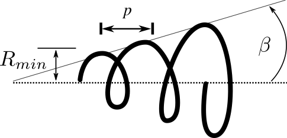
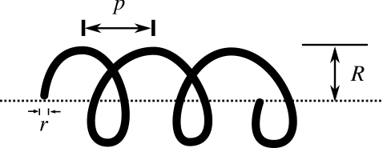
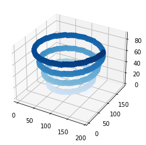

# Description

`helix.py` generates points forming a helical particle in a square computational grid. It does it by using the parametric equations for a helical trajectory following a conical path

$x = z \cdot\tan\beta \cos\phi$
$y = hz\cdot \tan\beta \sin\phi$
$z = \frac{p}{2\pi}\phi + \frac{R_{min}}{\tan\beta}$

where $\phi$ is the azimuthal angle (around the $z$ axis), ranging from 0 to $2\pi$, $h$ is the handedness parameter ($h=+1$ for a right-handed helix, and $h=-1$ for a left-handed helix), $p$ is the pitch (height of 1 turn in the helix), $\beta$ the half angle formed by the $z$ axis and the conical trajectory  $R_{min}$  is the lowest value for the radius measured from the $z$ axis. The figure below illustrates the parameters of a conical helix.




Notice that if $\beta = 0$, the helix is cylindrical and $R_{min}$ becomes the radius of a cylinder containing the helix, as illustrated below.
 


See this [link](https://mathworld.wolfram.com/Helix.html) for further details on parametric equations of helices.

The program generates the points as follows:
1. Use the parametric equations to generate a helical trajectory and store the points in 1D arrays
2. Generate the points forming a sphere of radius $r$.
3. Shift the generated helical trajectory points to the positive octant
4. Round up the values to integers 
5. Bitfield an 3D array with coordinates of occupied points to eliminate duplicate points
6. Generate a new array with the unique points forming the helical trajectory
7. Use every unique point in the helical trajectory to translate the points forming the sphere
8. Bitfield a 3D array with the coordinates of occupied points to eliminate duplicate points
9. Generate a new array with the unique points forming the helical particle

Lastly, the program has an option to export a .xyz file for [Jmol](https://jmol.sourceforge.net/) or a .tgt file for [OpenDDA](https://github.com/drjmcdonald/OpenDDA) containing the $(x,y,z)$ coordinates of each point.

## Usage

With your Python IDE

```Python
conical_spiral(30,1,4,20,50,2,doplot = True)
```

Outputs





