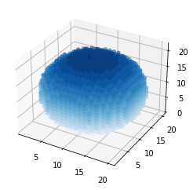

# Description

`sphere.py` generates points forming a spherical particle in a square computational grid. It does it by using the parametric equations for the surface of a sphere

$$x = r \sin\theta \cos\phi$$

$$y = r \sin\theta \sin\phi$$

$$z = r \cos\theta$$

where  $r$  is the radius of the sphere, $\phi$ is the azimuthal angle, ranging from 0 to $2\pi$, and $\theta$ the polar angle, ranging from 0 to $\pi$. See this [link](https://mathworld.wolfram.com/Sphere.html) for further details on parametric equations of spheres.

The program generates the points as follows:
1. Use the parametric equations to generate multiple concentric surfaces and store the points in 1D arrays
2. Shift the generated points to the positive octant
3. Round up the values to integers 
4. Bitfield an 3D array with coordinates of occupied points to eliminate duplicate points
5. Generate a new array with the unique points forming the sphere (both surface and interior points)

Lastly, the program has an option to export a .xyz file for [Jmol](https://jmol.sourceforge.net/) or a .tgt file for [OpenDDA](https://github.com/drjmcdonald/OpenDDA) containing the $(x,y,z)$ coordinates of each point.

## Usage

With your Python IDE

```Python
sphere(10, doplot = True)
```

Outputs


